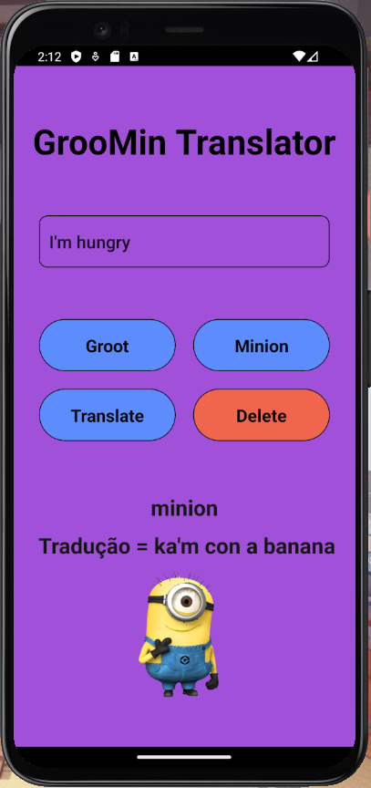

## Tradutor GrooMin;
* O app GrooMin traduz palavras do Inglês para o idioma Minion e para o idioma Groot. A tradução é feita através de uma API chamada "https://funtranslations.com/api/". 
* The GroomMin app translates words from the English language into Minion and Groot languages. The translation is done by an API called "https://funtranslations.com/api/".

    
    

## Download⬇️
* <a href="src/ReadmeSrc/groo_min_demo.mp4" download>Download do vídeo demo do aplicativo GrooMin</a>
* <a href="src/ReadmeSrc/groo_min_demo.mp4" download>Download a demo video off the GrooMin App here</a>

## Tecnologias (Technologies Used)💻
* React Native (Expo-cli)
* 
## Contato (Contact me)🔗
* Email: gabriel.avilaa27@gmail.com
* LinkedIn: https://www.linkedin.com/in/gabriel-avila-10a077218/
